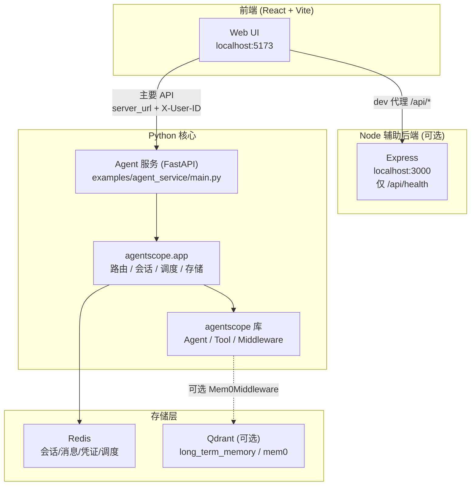
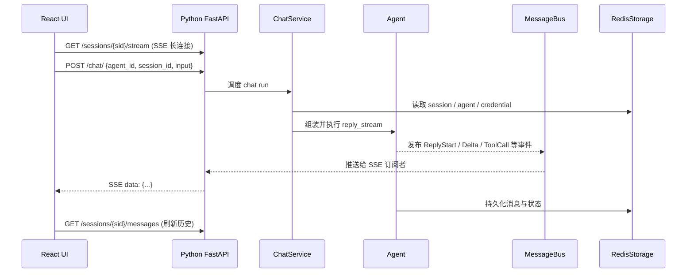

# AgentScope 项目架构学习文档

这份文档用于梳理当前仓库中 **Python Agent 核心**、**React Web UI**、**Node 辅助后端**、**long\_term\_memory（mem0）** 之间的关系，帮助快速建立“代码怎么跑起来、模块怎么串起来”的全局认知。

---

## 1. 一句话先说清

- Agent 主体与核心服务是 **Python**（`agentscope` + FastAPI）。
- Web 页面是 **React + Vite + TypeScript**（`examples/web_ui/frontend`）。
- `examples/web_ui/backend` 的 Node 服务目前是 **轻量辅助/占位**（主要健康检查），不是 Agent 主后端。
- long term memory 是 **Python 中间件能力**（mem0），默认示例中通常是可选接入，不是必经链路。

---

## 2. 代码分层与职责

### 2.1 核心库层（Python）

- 目录：`src/agentscope/`
- 作用：Agent 抽象、工具系统、模型适配、状态与事件、中间件、权限、工作区等核心能力。

重点子目录：

- `src/agentscope/agent/`：Agent 核心逻辑。
- `src/agentscope/app/`：服务化 API 层（FastAPI 路由与服务装配）。
- `src/agentscope/middleware/`：中间件体系（含 long term memory 扩展）。
- `src/agentscope/tool/`：工具抽象与执行。

### 2.2 服务入口层（Python FastAPI）

- 示例入口：`examples/agent_service/main.py`
- 通过 `create_app(...)` 装配：
  - `storage`（如 `RedisStorage`）
  - `message_bus`（如 `InMemoryMessageBus` 或 Redis 版本）
  - `workspace_manager`（如 `LocalWorkspaceManager`）
  - 自定义中间件、子智能体模板、MCP 配置等

### 2.3 前端层（React）

- 目录：`examples/web_ui/frontend/`
- 主要职责：
  - 配置服务地址与用户标识（`server_url`、`username`）
  - 管理会话与消息流
  - 发起聊天触发请求并消费 SSE 实时事件

### 2.4 Node 辅助后端层

- 目录：`examples/web_ui/backend/`
- 当前实现非常轻量，典型接口为 `/api/health`。
- 在开发环境中，Vite 会将 `/api` 代理到 `localhost:3000`；但 Agent 核心业务接口通常仍由 Python 服务承担。

---

## 3. 端到端调用链路（前端到 Agent）

### 3.1 前端如何决定请求目标

- `frontend/src/pages/setup/index.tsx` 会把用户输入保存到本地：
  - `localStorage.server_url`
  - `localStorage.username`
- `frontend/src/api/client.ts` 读取这些值：
  - `server_url` 作为 API Base URL
  - `username` 放入请求头 `X-User-ID`

这意味着：前端真正调用哪个后端，是由 Setup 页面配置的地址决定，而非写死。

### 3.2 Chat 的典型交互模式

当前设计是“**触发执行** + **SSE 接收事件**”双通道：

1. 前端 `POST /chat/` 触发一次 chat run（fire-and-forget）。
2. 前端保持 `GET /sessions/{session_id}/stream` 的 SSE 长连接，接收实时事件流。
3. 历史消息通过 `GET /sessions/{session_id}/messages` 拉取。

这种模式的优点：

- 聊天触发请求返回快，不阻塞在长响应上。
- UI 能持续接收推理过程中的增量事件（包括工具调用、确认事件等）。

---

## 4. Python 服务内部是怎么拼起来的

在 `examples/agent_service/main.py` 中，核心拼装关系可以概括为：

1. **Storage**：持久化会话、消息、配置等（示例常用 Redis）。
2. **Message Bus**：用于事件投递与会话唤醒。
3. **Workspace Manager**：管理工具执行环境与默认 MCP 客户端。
4. **Chat Service**：按 session 组装 Agent 实例，并挂载中间件后执行。

在 `src/agentscope/app/_service/_chat.py` 中可看到：

- 框架会先加基础中间件（如状态变更、tool offload 等）。
- 若提供 `extra_agent_middlewares`，会按 `(user_id, agent_id, session_id)` 动态补充额外中间件。

这为 long term memory 等能力的服务化接入提供了扩展点。

---

## 5. long_term_memory（mem0）到底是什么

### 5.1 不是“替代 Redis”，而是“补充记忆层”

要区分两类“记忆”：

- **服务存储（RedisStorage）**：
  - 保存会话、消息记录、Agent 配置、调度等“系统数据”。
- **长期语义记忆（Mem0Middleware）**：
  - 保存跨会话的用户偏好/事实等“语义记忆”，用于未来检索增强。

两者并行，不冲突。

### 5.2 接入位置

mem0 的实现位于：

- `src/agentscope/middleware/_longterm_memory/_mem0/_middleware.py`
- 示例文档与演示在：
  - `examples/long_term_memory/mem0/README.md`
  - `examples/long_term_memory/mem0/oss_demo.py`

在服务模式中，一般通过 `create_app(..., extra_agent_middlewares=...)` 注入。

### 5.3 工作方式（高层）

按模式不同，mem0 中间件可实现：

- 自动检索并注入相关记忆到当前上下文
- 回复后把新信息写回记忆库
- 暴露 `search_memory` / `add_memory` 工具给 Agent 主动调用

底层通常使用向量存储（如 Qdrant）来实现语义检索。

---

## 6. Web UI 的 Node 服务在当前仓库中的定位

结论：**它不是 Agent 主服务**。

- Node 端目前实现很轻（例如健康检查）。
- Python FastAPI 才是 Agent 对话、会话、模型、工具、调度的主承载层。
- 因为前端支持自定义 `server_url`，你可以直接把前端指向 Python 服务地址进行核心功能调试。

---

## 7. 本地运行时的典型进程关系

常见开发态：

1. Redis（如 `localhost:6379`）
2. Python Agent 服务（如 `localhost:8000` 或 `8001`）
3. Web UI 前端（如 `localhost:5173`）
4. Node 辅助后端（如 `localhost:3000`，可选）

建议理解为：

- “必须有”：Python Agent 服务 + 前端（以及其依赖存储）
- “可选补充”：Node 辅助后端、long term memory（mem0/Qdrant）

---

## 8. 学习与改造建议（按优先级）

1. 先跑通主链路：前端配置 `server_url` -> 能触发 chat -> SSE 收到事件。
2. 再理解服务拼装：从 `examples/agent_service/main.py` 追到 `src/agentscope/app/`。
3. 然后看中间件扩展：`_chat.py` 中 middlewares 如何注入与执行。
4. 最后接 long term memory：先跑 `examples/long_term_memory/mem0/oss_demo.py`，再迁移到 `extra_agent_middlewares`。

---

## 9. 常见误区速记

- 误区 1：Node 是主后端  
  实际：Python FastAPI 才是 Agent 主后端。

- 误区 2：Redis 已经是 long term memory  
  实际：Redis 主要是系统数据存储；long term memory 是 mem0 这类语义记忆扩展。

- 误区 3：`POST /chat/` 会直接返回完整回复  
  实际：它主要是触发执行，实时输出走 SSE。

---

## 10. 你可以继续补充的内容模板

后续可在本文件追加：

- “我的本地端口与启动命令”
- “我接入的模型与凭证配置”
- “我新增的中间件与工具”
- “故障排查记录（按日期）”

这样这份文档就会从“学习文档”自然成长为“项目运行手册 + 改造日志”。

---

## 11. 架构关系图



---

## 12. 最小可运行实验清单（约 10 分钟）

按顺序做，每一步通过再进入下一步。全部通过即表示主链路已跑通。

| 步骤 | 验证目标 | 通过标准 |
|------|----------|----------|
| 1 | Python 环境 | `python --version` ≥ 3.11，`import agentscope` 无报错 |
| 2 | Redis | `redis-cli ping` 返回 `PONG` |
| 3 | Agent 服务 | `curl` 能访问 OpenAPI 文档页 |
| 4 | Node 辅助后端（可选） | `GET /api/health` 返回 `{"status":"ok"}` |
| 5 | 前端 dev server | 浏览器能打开 `http://localhost:5173` |
| 6 | Setup 配置 | 填入 `server_url` 与 `username` 后能进入主界面 |
| 7 | 创建 Agent + Session | UI 能新建智能体并进入聊天页 |
| 8 | Chat + SSE | 发消息后 UI 出现流式回复（非一次性阻塞返回） |

> 步骤 4 可跳过：Node 后端不参与 Agent 主流程，仅用于 dev 代理下的健康检查。

---

## 13. 本地启动命令

以下命令假设仓库根目录为项目根，且已创建 `.venv` 并安装依赖。

### 13.1 一次性准备

```bash
# 仓库根目录
uv venv --python 3.11 .venv
source .venv/bin/activate
uv pip install -e '.[full]'

# 启动 Redis（macOS Homebrew 示例）
brew services start redis

# 安装前端依赖
cd examples/web_ui && pnpm install
```

### 13.2 启动各进程（建议开 3～4 个终端）

**终端 1 — Python Agent 服务**

```bash
cd examples/agent_service
source ../../.venv/bin/activate

# 若 8000 被占用，改用 8001
uvicorn main:app --host 0.0.0.0 --port 8001 --reload
```

**终端 2 — Web UI 前端（含 Node 辅助后端）**

```bash
cd examples/web_ui
pnpm dev
# 等价于 concurrently 启动 frontend:5173 + backend:3000
```

**终端 3 — 仅前端（若不需要 Node）**

```bash
cd examples/web_ui
pnpm dev:frontend
```

### 13.3 前端 Setup 页配置

| 字段 | 示例值 | 说明 |
|------|--------|------|
| Server URL | `http://localhost:8001` | 指向 Python FastAPI，不是 Node |
| Username | `alice` | 会作为 `X-User-ID` 请求头发送 |

---

## 14. 分层 curl 验证

将 `BASE`、`USER` 替换为你的实际值：

```bash
export BASE=http://localhost:8001
export USER=alice
```

### 14.1 基础设施

```bash
# Redis
redis-cli ping

# Python 服务 — OpenAPI 文档
curl -s -o /dev/null -w "%{http_code}" $BASE/docs
# 期望: 200

# Node 辅助后端（可选）
curl -s http://localhost:3000/api/health
# 期望: {"status":"ok"}
```

### 14.2 Python API — 需带 X-User-ID

```bash
# 列出 Agent（新用户可能为空列表）
curl -s -H "X-User-ID: $USER" $BASE/agent/

# 创建 Agent
curl -s -X POST -H "X-User-ID: $USER" -H "Content-Type: application/json" \
  -d '{"name":"test-agent","system_prompt":"You are helpful."}' \
  $BASE/agent/
# 记下返回的 agent_id

# 创建 Session（将 AGENT_ID 替换为上一步返回值）
curl -s -X POST -H "X-User-ID: $USER" -H "Content-Type: application/json" \
  -d '{"agent_id":"AGENT_ID"}' \
  $BASE/sessions/
# 记下返回的 session_id
```

> 实际聊天还需要在 UI 中配置模型凭证（Credential）并为 Session 绑定模型；纯 curl 触发 chat 前需先完成凭证与 session config。UI 流程更省事，curl 适合验证 API 可达性。

### 14.3 SSE 流（另开终端）

```bash
# 将 SESSION_ID 替换为实际值；连接会保持打开
curl -N -H "X-User-ID: $USER" "$BASE/sessions/SESSION_ID/stream"
```

在 UI 或另一个终端 `POST /chat/` 触发对话后，此终端应收到 `data: {...}` 形式的事件行。

---

## 15. 主 API 速查表

前端 `src/api/` 与 Python 路由的对应关系：

| 前端模块 | HTTP | 路径 | 作用 |
|----------|------|------|------|
| `agent.ts` | GET/POST/PATCH/DELETE | `/agent/` | Agent CRUD |
| `session.ts` | GET/POST/PATCH/DELETE | `/sessions/` | 会话管理 |
| `session.ts` | GET | `/sessions/{id}/messages` | 历史消息 |
| `session.ts` | GET (SSE) | `/sessions/{id}/stream` | 实时事件流 |
| `chat.ts` | POST | `/chat/` | 触发 chat run |
| `credential.ts` | * | `/credential/` | 模型凭证 |
| `model.ts` | GET | `/model/` | 可用聊天模型列表 |
| `schedule.ts` | * | `/schedule/` | 定时任务 |
| `workspace.ts` | * | `/workspace/` | MCP、Skill 等工作区 |

公共请求头：

- `X-User-ID`：必填，多租户用户标识（来自 Setup 页的 username）
- `Content-Type: application/json`：有 body 的 POST/PATCH 请求

---

## 16. 一次完整聊天的时序



要点：

1. `POST /chat/` 只负责「点火」，响应体通常是 `{ status, session_id }`。
2. 真正的流式输出走已建立的 SSE 连接。
3. `streaming` 状态由事件驱动（`ReplyStartEvent` → 开始，`ReplyEndEvent` → 结束），不是由 HTTP 响应生命周期决定。

---

## 17. long_term_memory 接入步骤（可选）

默认 `examples/agent_service/main.py` **未启用** mem0。若要接入：

### 17.1 库模式（先理解机制）

```bash
pip install "agentscope[mem0]"
export DASHSCOPE_API_KEY=sk-...
python examples/long_term_memory/mem0/oss_demo.py
```

观察两轮对话中 mem0 的检索与写回日志。

### 17.2 服务模式（挂到 create_app）

在 `main.py` 中增加 `extra_agent_middlewares` 工厂（详见 `examples/long_term_memory/mem0/README.md` 的 “Service-mode integration” 一节）：

```python
async def long_term_memory_factory(user_id, agent_id, session_id):
    return [
        Mem0Middleware(
            user_id=user_id,
            client=mem0_client,  # 模块级单例，避免 Qdrant 文件锁冲突
            mode="both",
        ),
    ]

app = create_app(
    ...,
    extra_agent_middlewares=long_term_memory_factory,
)
```

注意：

- `user_id` 来自请求头 `X-User-ID`，与前端 Setup 页的 username 一致。
- mem0 默认用本地 Qdrant；多进程场景建议 Docker 起 Qdrant 服务。
- Redis 与 mem0 各司其职，接入 mem0 后 Redis 仍负责会话等系统数据。

---

## 18. 故障排查速查

| 现象 | 可能原因 | 处理 |
|------|----------|------|
| `python3` 版本 < 3.11 | 系统 Python 过旧 | `uv venv --python 3.11 .venv` |
| Agent 服务 `Address already in use` | 8000 被占用 | `uvicorn main:app --port 8001` |
| 前端请求 401/422 缺 header | 未配置 username | Setup 页填写 Username |
| 前端请求连错后端 | `server_url` 指向 Node | 改为 Python 地址，如 `http://localhost:8001` |
| Redis 连接失败 | Redis 未启动 | `brew services start redis` 或 Docker 起 Redis |
| 发消息后无流式输出 | SSE 未连接或 chat 未触发 | 确认 stream 已建立；检查 `/chat/` 是否 200 |
| `POST /chat/` 返回 409 | 同 session 已有 run 在执行 | 等待上一轮结束或换 session |
| mem0 Qdrant 锁冲突 | 多个进程各建 AsyncMemory | 模块级共享一个 `mem0_client` |

---

## 19. 推荐阅读顺序（源码）

1. `examples/agent_service/main.py` — 服务如何装配
2. `src/agentscope/app/_app.py` — `create_app` 注册了哪些路由
3. `src/agentscope/app/_router/_chat.py` — chat 触发逻辑
4. `src/agentscope/app/_router/_session.py` — SSE stream 实现
5. `src/agentscope/app/_service/_chat.py` — Agent 组装与 middleware 注入
6. `examples/web_ui/frontend/src/hooks/useMessages.ts` — 前端如何消费 SSE
7. `examples/long_term_memory/mem0/README.md` — 长记忆扩展（可选）

---

## 20. 相关文档

- [project-onboarding-and-structure.md](./project-onboarding-and-structure.md) — 本地启动实操记录与目录说明
- [examples/long_term_memory/mem0/README.md](../examples/long_term_memory/mem0/README.md) — mem0 中间件详细文档
- [官方文档](https://docs.agentscope.io/) — AgentScope 2.0 完整参考
